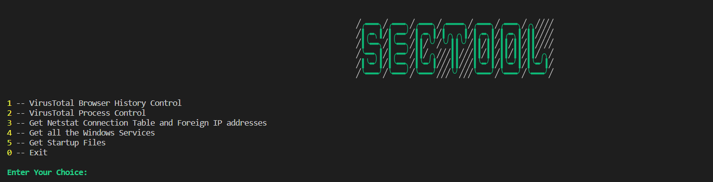
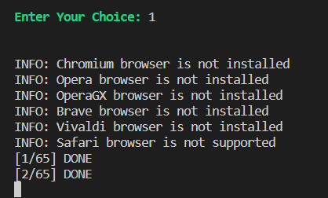
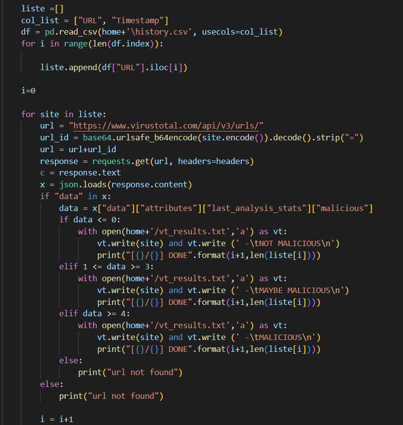

# SecTool
I developed Security Tool for Windows with python in order to analyise system more efficiently. I used VirusTotal API, Windows System Internals.
<br>
||
|---------|
| Main Menu |
<br>

## To Run Project in Terminal
- ### If you want to run the scipt in terminal, you have to look at <a href="https://github.com/mrtergl/VirusTotal_Python_URL_Scan">this link</a>.
- ### Do not change the folder and file names in python script.
- ### All files will be at C:/Users/{user}/SecTool.

<br>

## Necessary Libraries:

| Library  | Code to install |
| ------------- | ------------- |
| hashlib  | ``` pip install hashlib ```  |
| pathlib2  | ``` pip install pathlib2 ```  |
| WMI  |``` pip install WMI ``` |
| requests | ``` pip install requests ```|
| browser-history 0.3.2 | ``` pip install browser-history ```|
| psutil 5.9.1 | ``` pip install psutil ```|
| python-cfonts 1.5.2 | ``` pip install python-cfonts ```|
| colorama 0.4.5 | ``` pip install colorama ```|
| pywin32 304 | ``` pip install pywin32 ```|
| openpyxl 3.0.10 | ``` pip install openpyxl ```|
<br>

## Scan Browser History with VirusTotal

#### In this option you can scan all the browser history in device using Virus Total. This is the updated version of one of my repos <a href="https://github.com/mrtergl/VirusTotal_Python_URL_Scan">URL_SCAN</a>.

|||
|---------|---------|
| Terminal view | Code |

<br>
There will be "history.csv" file for all the browser histories.
#### After scanning. You can see the results in C:/Users/{username}/SecTool/vt_results.txt .
<br>
## Scan Running Processes with their hash in VirusTotal
## Scan all the foreign IP addresses that communicating with device in VirusTotal
## Get Netstat Connection Table and Foreign IP addresses
## Get all the Windows Services
## Get Startup Files

