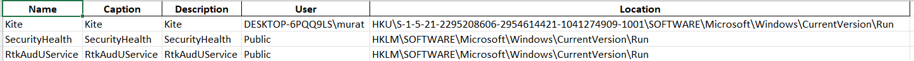

# SecTool
I developed Security Tool for Windows with python in order to analyse system more efficiently. I used VirusTotal API, Windows System Internals, WMI queries.
<br>
||
|---------|
| Main Menu |
<br>

## To Run Project in Terminal
- ### The API Key for VirusTotal is mine. You can replace it with yours if you have advantaged profile in VirusTotal.
- ### Do not change the folder and file names in python script.
- ### All files will be at C:/Users/{user}/SecTool.

<br>

## Necessary Libraries:

| Library  | Code to install |
| ------------- | ------------- |
| hashlib  | ``` pip install hashlib ```  |
| pathlib2  | ``` pip install pathlib2 ```  |
| WMI  |``` pip install WMI ``` |
| requests | ``` pip install requests ```|
| browser-history 0.3.2 | ``` pip install browser-history ```|
| psutil 5.9.1 | ``` pip install psutil ```|
| python-cfonts 1.5.2 | ``` pip install python-cfonts ```|
| colorama 0.4.5 | ``` pip install colorama ```|
| pywin32 304 | ``` pip install pywin32 ```|
| openpyxl 3.0.10 | ``` pip install openpyxl ```|
<br>

## 1- Scan Browser History with VirusTotal

#### In this option you can scan all the browser history in device using Virus Total. This is the updated version of one of my repos <a href="https://github.com/mrtergl/VirusTotal_Python_URL_Scan">URL_SCAN</a>.

|||
|---------|---------|
| Terminal View | Code |

<br>
There will be "history.csv" file for all the browser histories.

#### After scanning. You can see the results in C:/Users/{username}/SecTool/vt_results.txt .

||
|---------|
| Results |

<br>

## 2- Scan Running Processes with their hash in VirusTotal

#### In this option you can scan all the processes hash running in device using Virus Total. This is the updated version of one of my repos <a href="https://github.com/mrtergl/VirusTotal_Process_Scan">Process_Scan</a>.

|||
|---------|---------|
| Terminal View | Code |

<br>

It takes a bit long because it searchs for the absolute path of the process to get the hash of it. After finding the hash, it scans in the Virustotal. You can find the scanned process in "vt_Results_exe.txt". After all the process scanned. It will be shown at an excel file called "vt_Results_exe.xlsx".
<br>

|||
|---------|---------|
| Text File | Excel File |

#### Note: .txt file will be converted to .xlsx file after scanning.

<br>

## 3- Scan all the foreign IP addresses that communicating with device in VirusTotal

#### In this option you can see all the connections from your device to the Internet. It will show you the output of "netstat -ano" command as .txt file and will ask for the scan of foreign address in VirusTotal.

|||
|---------|---------|
| Terminal view | Code |

<br>

#### If you say "y", it will scan all the IP adress and write down results to an excel file called "IP_RESULTS.xlsx". 

<br>

|||
|---------|---------|
| Terminal View | Results |

## 4- Get all the Windows Services

#### In this option you can get all the Windows Services. It will get all services and writes down an excel file.

|||
|---------|---------|
| Terminal View | Code |

<br>

#### I used psutil to get services.

<br>

||
|---------|
| Results |

## 5- Get Startup Files

#### In this option you can see all the Startup Programs which started when user logged in. I used WMI Query to get them.

<br>

||||
|---------|---------|---------|
| Terminal View | Code | Results |

<br>

## 6- Upload Files to VirusTotal and Get Analyse Report

#### In this option you can upload suspicious files to VirusTotal. You will get a report of analyzed file.

#### Upload File

 <br>
 
|||
|---------|---------|
| Terminal View | Code |

<br>

#### Getting Analyse Report

<br>
 
|||
|---------|---------|
| File Upload | Getting File Report |

#### This part may take few minutes. Virus Total making a query with an id which is coming from uploaded file. It'll be added a queue, that's why getting analyse report process may take a while.

||
|---------|
| Results |

<br>

File will be generated with the name of file in the SecTool folder.

